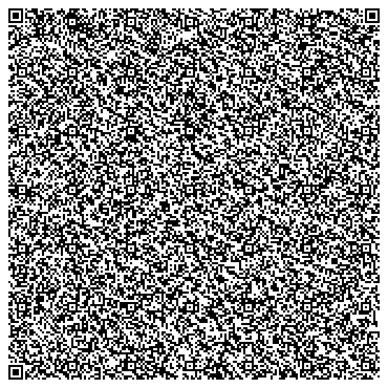

# qrfontain
Transferring data through a sequence of QR codes using a fountain code.

This tool enables file transfers by generating multiple QR codes using 
the [Luby Transform Code](https://en.wikipedia.org/wiki/Luby_transform_code) thanks to [anrosent/Lt-code](https://github.com/anrosent/LT-code).
This fountain code allows the receiver to scan the QR codes in any order while minimizing the amount of data required 
to retrieve the complete file.




## Installation 

```
git clone git@github.com:dridk/qrfontain
cd qrfontain 
python -m virtualenv venv 
pip install -e . 

```

## Usage
### Encode and Decode a stream of QR Code

You can stream data to QR Codes using a generator of PIL Images: 

```python
import qrfontain 

with open("big.txt", "rb") as file:

  for image in qrfontain.data_to_qrcode(file):
    # Display image 
    # show(image)  


```

You can decode PIL images as follow : 

```python
import qrfontain 

with open("output.txt", "wb") as file:

  # Get QR Code images 
  # images = Generator.. 
  data = qrfontain.data_from_qrcode(images)
  file.write(data)

```

There is a short hand to create a video with a sample of qrcode generated :

### From python 
```python

import qrfontain 
qrfontain.create_video("big.txt", "big.webm")

```

### From bash

```bash
qrfontain --input big.txt --output  big.webm

```

## Decode using a gui_receiver.py

I made a GUI to extract animated QR codes from your desktop.      
Install Pyside6 ```pip install pyside6``` and  run ```python gui_receiver.py```

Check the video above: 


## Similar projects 
- [https://github.com/digitalbazaar/qram](https://github.com/digitalbazaar/qram)
- [https://github.com/divan/txqr](https://github.com/divan/txqr)


